# 🔐 Fase 1 — Entorno y Línea Base Ofensiva

> **Universidad Central del Ecuador** · Facultad de Ingeniería y Ciencias Aplicadas · Carrera de Computación  
> Criptografía y Seguridad de la Información — Trabajo Grupal 2026

| Campo | Detalle |
|---|---|
| **Asignatura** | Criptografía y Seguridad de la Información |
| **Entregable** | Fase 1 — Entorno y Línea Base Ofensiva |
| **Aplicación objetivo** | DVJA — Damn Vulnerable Java Application |
| **Repositorio oficial DVJA** | https://github.com/appsecco/dvja |
| **Período académico** | 2026 – 2026 |

---

## 📋 Tabla de Contenidos

1. [Levantamiento del entorno con Docker Compose](#1-levantamiento-del-entorno-con-docker-compose)
   - [Repositorio y clonado](#11-repositorio-y-clonado)
   - [Errores encontrados y correcciones](#12-errores-encontrados-y-correcciones-aplicadas)
   - [Levantamiento exitoso](#13-levantamiento-exitoso-del-entorno)
2. [Identificación y explotación de vulnerabilidades](#2-identificación-y-explotación-de-vulnerabilidades-owasp-top-ten)
   - [Mapeo de endpoints](#21-mapeo-de-endpoints-superficie-de-ataque)
   - [VULN-01 · HQL Injection](#vuln-01--hql-injection)
   - [VULN-02 · Stored XSS](#vuln-02--stored-xss-cross-site-scripting-almacenado)
   - [VULN-03 · Fallas Criptográficas](#vuln-03--fallas-criptográficas-md5-sin-salt)
3. [Resumen de vulnerabilidades](#3-resumen-de-vulnerabilidades-identificadas)
4. [Conclusiones](#4-conclusiones-de-la-fase-1)

---

## 1. Levantamiento del entorno con Docker Compose

El entorno de pruebas se levantó utilizando el repositorio oficial de DVJA clonado desde GitHub. Se utilizó Docker Compose para orquestar los servicios necesarios (aplicación Java + base de datos MySQL).

### 1.1 Repositorio y clonado

Repositorio oficial: https://github.com/appsecco/dvja

El repositorio se clonó desde un fork personal en GitHub, permitiendo registrar el historial de commits y las modificaciones realizadas:

```bash
git clone "https://github.com/<tu-usuario>/dvja"
```

### 1.2 Errores encontrados y correcciones aplicadas

Al momento de levantar el proyecto se presentaron dos inconvenientes técnicos:

---

#### 🔴 Error 1 — Versión de JDK no soportada por Docker

La imagen base del Dockerfile original utilizaba una versión de Java JDK obsoleta e incompatible con la arquitectura del host. Se reemplazó por la imagen activa y mantenida de Eclipse Temurin:

```dockerfile
# Antes (imagen obsoleta):
FROM java:openjdk-8

# Después (imagen LTS activa):
FROM eclipse-temurin:8-jdk
```

**Dockerfile final corregido:**

```dockerfile
FROM eclipse-temurin:8-jdk
MAINTAINER Abhisek Datta <abhisek@appsecco.com>

RUN apt-get update
RUN apt-get install -y default-mysql-client
RUN apt-get install -y maven

WORKDIR /app
COPY pom.xml pom.xml
RUN mvn dependency:resolve

COPY . .
RUN mvn clean package
RUN chmod 755 /app/scripts/start.sh

EXPOSE 8080
CMD ["sh", "-c", "/app/scripts/start.sh"]
```

---

#### 🔴 Error 2 — Script `start.sh` no encontrado (CRLF vs LF)

El contenedor intentaba arrancar ejecutando el script `start.sh`, pero Docker no lo encontraba. Este error ocurre en entornos Windows porque Git convierte automáticamente los saltos de línea de LF (`\n`, formato Linux) a CRLF (`\r\n`, formato Windows). El intérprete de shell dentro del contenedor Linux no reconoce el carácter `\r` y reporta el archivo como no encontrado.

```
ERROR: sh: 1: /app/scripts/start.sh: not found
```

**Solución aplicada en Visual Studio Code:**

1. Abrir el archivo `scripts/start.sh` en VS Code
2. En la barra de estado inferior derecha, hacer clic en `CRLF`
3. Seleccionar `LF` en el menú desplegable
4. Guardar el archivo (`Ctrl+S`)

---

### 1.3 Levantamiento exitoso del entorno

Con los errores corregidos, el entorno se levantó correctamente:

```bash
docker-compose up
```
**Proyecto Levantado**
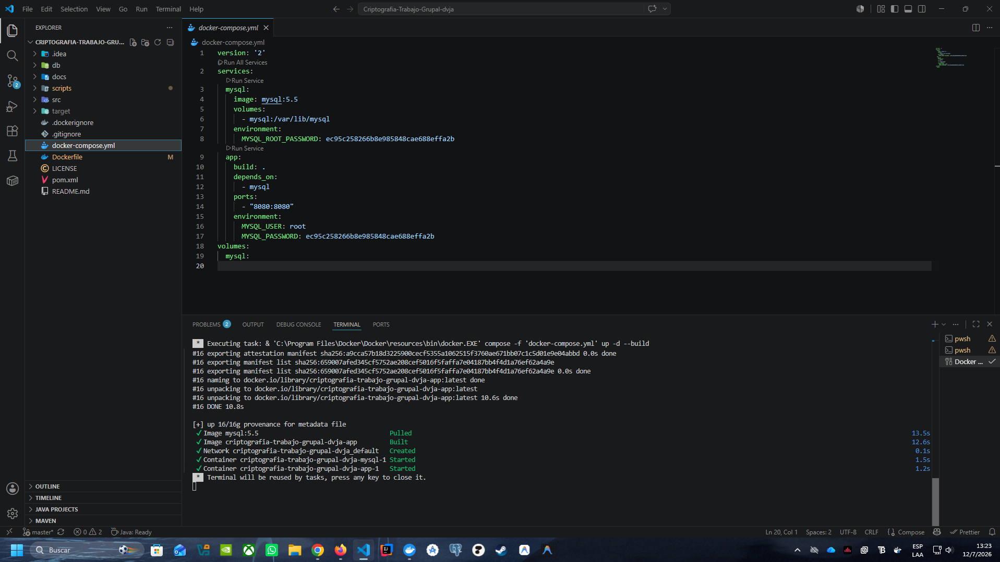
La aplicación quedó disponible en: **http://localhost:8080**

**Aplicaciónn Corriendo**
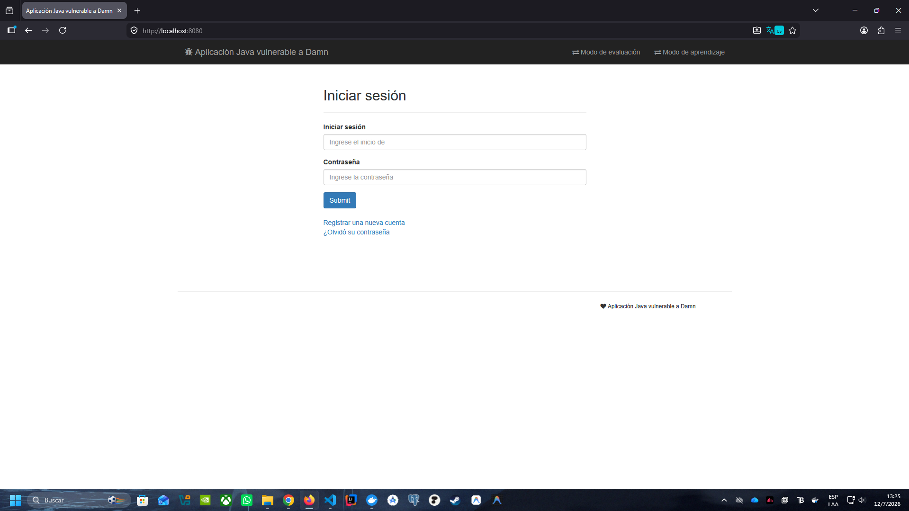

---

## 2. Identificación y explotación de vulnerabilidades OWASP Top Ten

Se realizó un mapeo inicial de todos los endpoints disponibles en la aplicación antes de proceder con las pruebas de explotación. El navegador utilizado para las pruebas fue **Mozilla Firefox**.

### 2.1 Mapeo de endpoints (superficie de ataque)

| Endpoint | Función | Método HTTP |
|---|---|---|
| `/userSearch.action` | Búsqueda de usuarios por login | POST |
| `/ping.action` | Utilidad de ping a host | POST |
| `/register.action` | Registro de nuevo usuario | POST |
| `/login.action` | Autenticación de usuario | POST |
| `/userProfile.action` | Perfil del usuario logueado | GET |
| `/addEditProduct.action` | Creación/edición de producto | POST |
| `/listProduct.action` | Listado de productos | GET |

---

## VULN-01 · HQL Injection

| Campo | Detalle |
|---|---|
| **ID** | VULN-01 |
| **Nombre** | HQL Injection (Hibernate Query Language Injection) |
| **Categoría OWASP** | A05:2025 — Injection |
| **CWE** | CWE-943 |
| **Severidad** | 🔴 CRÍTICA |
| **Endpoint afectado** | `/userSearch.action` |
| **Parámetro vulnerable** | `login` (POST) |
| **Entidad afectada** | `User` (Hibernate entity) |
| **Archivo fuente** | `UserService.java` |

### Descripción técnica

DVJA utiliza Hibernate como ORM para gestionar las consultas a la base de datos. La vulnerabilidad existe porque el parámetro `login` del formulario de búsqueda se concatena directamente en la consulta HQL sin sanitización:

```java
// CÓDIGO VULNERABLE — UserService.java
Query query = entityManager.createQuery(
    "SELECT u FROM User u WHERE u.login = '" + login + "'"
);
```

### Prueba 1 — Comprobación manual de la vulnerabilidad

Se ingresó una comilla simple (`'`) en el campo de búsqueda del endpoint `/userSearch.action`. La aplicación respondió con un error de Hibernate/JPA que expone la estructura interna de la consulta:

```
Error Occurred: org.hibernate.QueryException: expecting '<EOF>'
[SELECT u FROM com.appsecco.dvja.models.User u WHERE u.login = '']
```

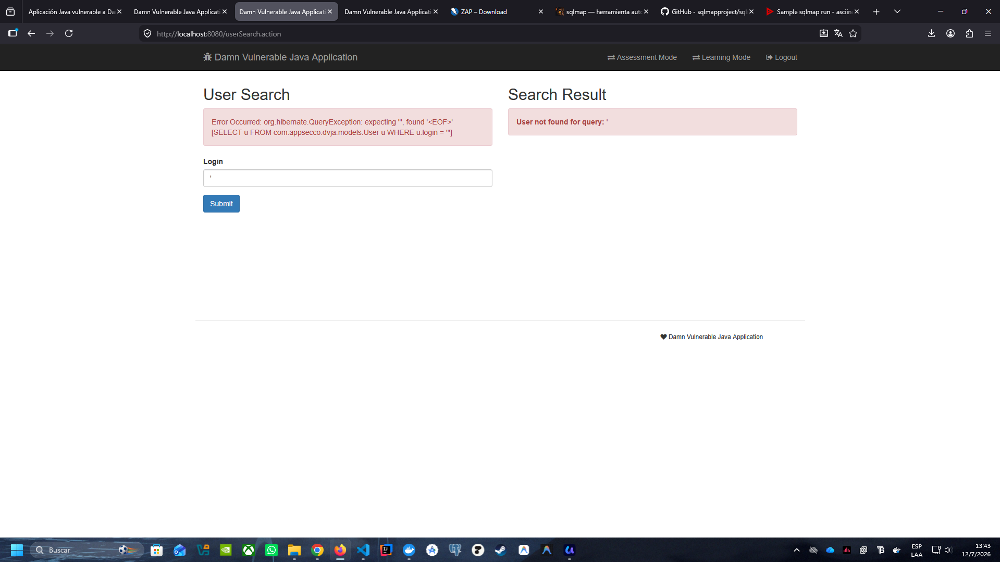

### Prueba 2 — Payload de enumeración de usuarios

Se utilizó el payload clásico de HQL para retornar registros sin condición válida:

```
' OR '1'='1
```

La aplicación respondió mostrando un usuario de la base de datos, confirmando que la inyección altera la lógica de la consulta.

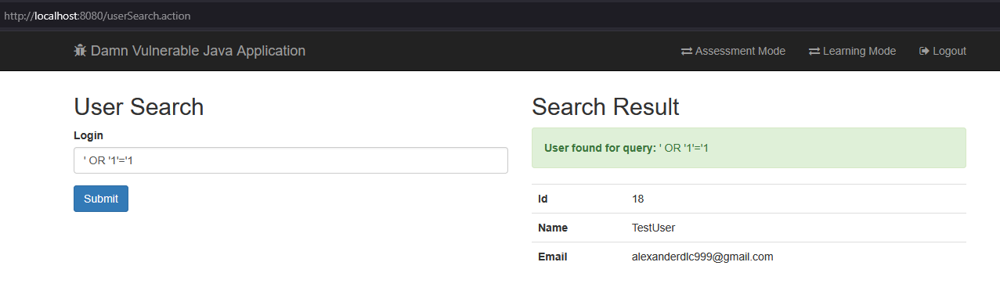

> **Nota técnica:** La interfaz web muestra únicamente el primer resultado del conjunto retornado por la consulta (comportamiento de la vista JSP). Esto no limita el impacto real — la inyección modifica la consulta para retornar todos los registros. El exploit automatizado con sqlmap confirma la extracción completa de la entidad `User`.

### Prueba 3 — Detección automática con sqlmap

sqlmap es una herramienta de código abierto que automatiza la detección y explotación de inyecciones SQL/HQL.  
Repositorio: https://github.com/sqlmapproject/sqlmap

**Requisitos para la prueba:**
- Clonar el repositorio de sqlmap (herramienta independiente de DVJA)
- Obtener el `JSESSIONID` de las cookies de sesión activas (`F12` → Almacenamiento → Cookies → `localhost:8080`)
- Identificar el endpoint y parámetro a probar

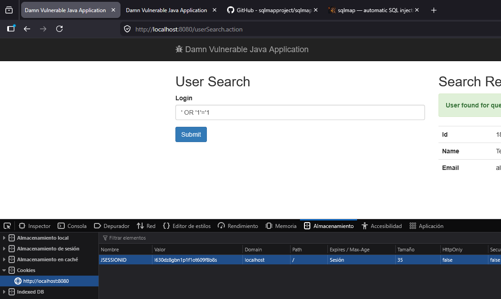

**Paso 1 — Detección inicial:**

```bash
py sqlmap.py -u "http://localhost:8080/userSearch.action" --forms \
  --cookie="JSESSIONID=l630dz8gbn1p1f1ot609f8b8s" --batch
```

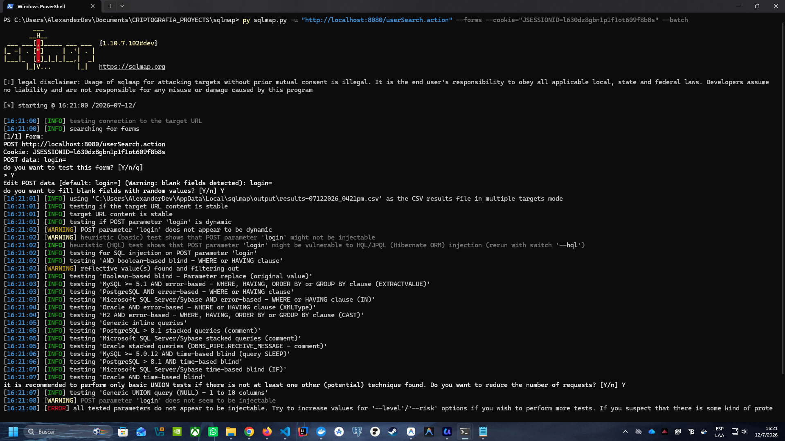

Resultado: sqlmap no detectó SQL Injection tradicional en MySQL, pero identificó que la aplicación usa Hibernate y que el parámetro `login` podría ser vulnerable a HQL/JPQL Injection (indicado como `rerun with switch --hql`).

**Paso 2 — Explotación HQL profunda:**

```bash
py sqlmap.py -u "http://localhost:8080/userSearch.action" --forms \
  --cookie="JSESSIONID=l630dz8gbn1p1f1ot609f8b8s" --batch --hql --level 3 --risk 2
```

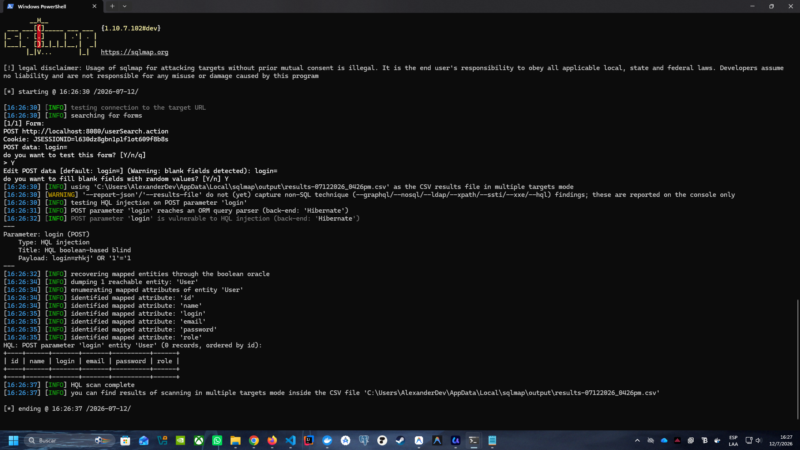

Resultado: sqlmap confirmó la vulnerabilidad HQL (boolean-based blind) y enumeró los atributos mapeados de la entidad `User`:

| Atributo descubierto | Tipo | Observación |
|---|---|---|
| `id` | Integer | Identificador único |
| `name` | String | Nombre del usuario |
| `login` | String | Usuario de autenticación |
| `email` | String | Correo electrónico |
| `password` | String | Hash de contraseña (MD5) |
| `role` | String | Rol en la aplicación |

Se probaron todos los endpoints que presentan inserción de datos por el usuario y no se detectaron presencia de inyección SQL o HQL adicional en los demás parámetros.

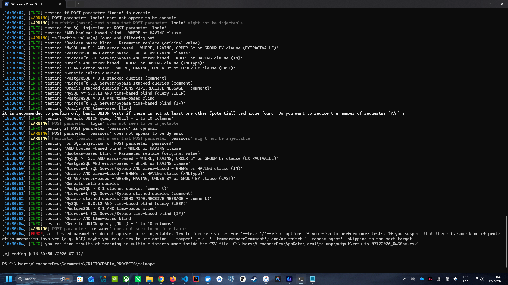

### Impacto

Un atacante con acceso al endpoint puede extraer todos los atributos de la entidad `User` incluyendo credenciales hasheadas, manipular la lógica de autorización, y enumerar todos los usuarios registrados en el sistema. Dado que las contraseñas están hasheadas con MD5 (ver VULN-03), la combinación de estas dos vulnerabilidades permite comprometer completamente las cuentas de usuario.

---

## VULN-02 · Stored XSS (Cross-Site Scripting Almacenado)

| Campo | Detalle |
|---|---|
| **ID** | VULN-02 |
| **Nombre** | Stored XSS — Cross-Site Scripting Almacenado (Persistente) |
| **Categoría OWASP** | A05:2025 — Injection |
| **CWE** | CWE-79 |
| **Severidad** | 🟠 ALTA |
| **Endpoint afectado** | `/addEditProduct.action` (inyección) · `/listProduct.action` (ejecución) |
| **Campo vulnerable** | `Product Name` |
| **Método HTTP** | POST |
| **Archivo fuente** | `addEditProduct.jsp` (salida sin escapado) |

### Descripción técnica

Los ataques XSS ocurren cuando una aplicación incluye datos no confiables en la respuesta HTML sin validarlos ni codificarlos. En DVJA, el campo `Product Name` acepta y almacena código HTML/JavaScript en la base de datos sin ninguna sanitización. Al ser **Stored XSS** (XSS Persistente), el payload malicioso queda guardado en la base de datos y se ejecuta cada vez que cualquier usuario visita la lista de productos, afectando a múltiples víctimas.

### Flujo del ataque

**Paso 1** — Autenticarse en la aplicación con un usuario registrado.

**Paso 2** — Navegar a la sección de creación de producto: `/addEditProduct.action`

**Paso 3** — En el campo `Product Name`, ingresar el siguiente payload en lugar de un nombre normal:

```html
<script>alert('Vulnerabilidad XSS en DVJA')</script>
```

**Paso 4** — Completar el resto de campos y hacer clic en `Submit`.

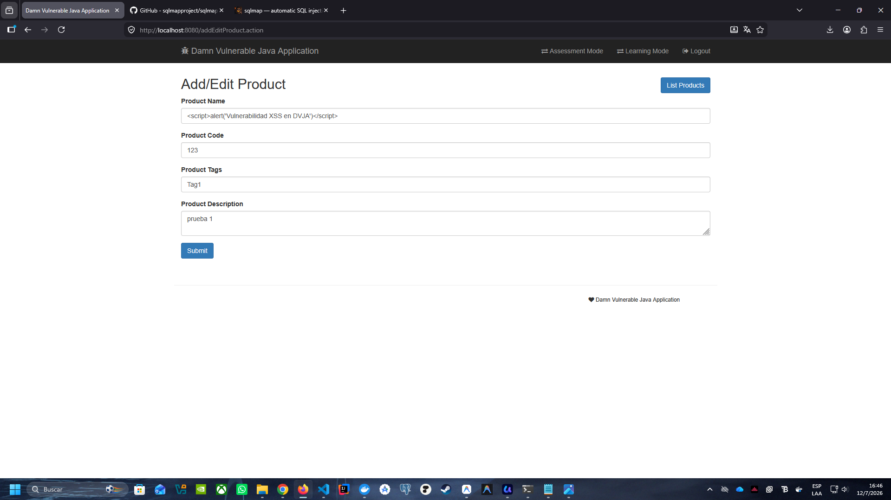

**Paso 5** — Navegar a `/listProduct.action`. El navegador ejecuta el script almacenado:

**Script Ejecutandose**

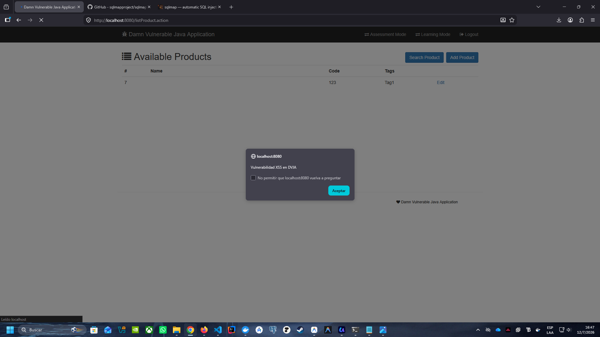

### Escalada del ataque — Redirección maliciosa

Para demostrar un impacto más severo, se inyectó un segundo payload de redirección que simula un ataque de phishing:

```html
<script>
  window.location.href = "http://sitio-falso-de-phishing.com";
</script>
```

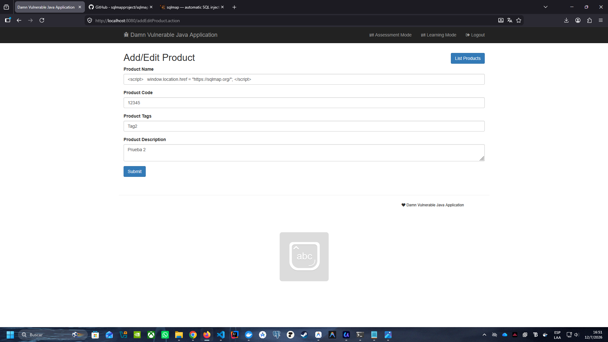

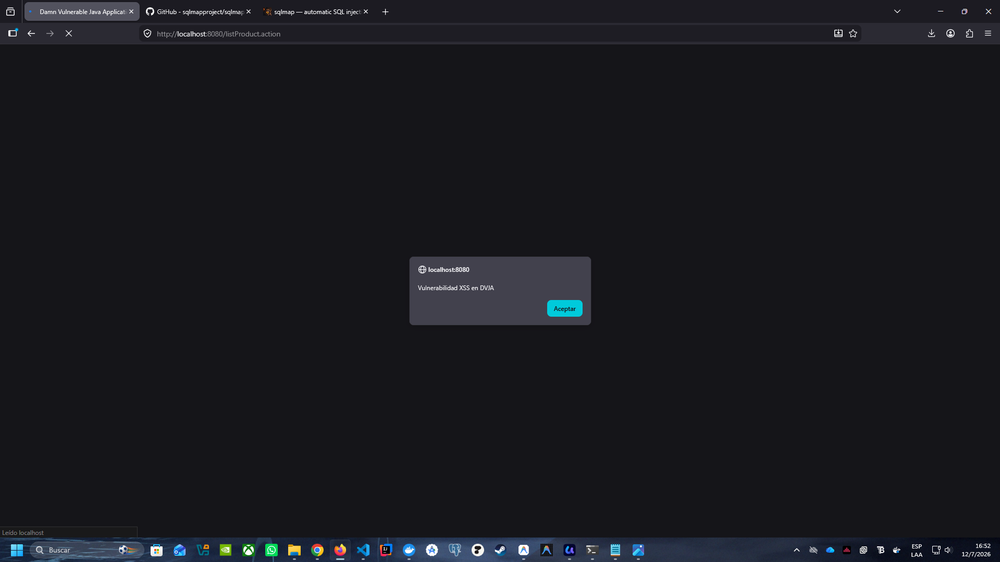

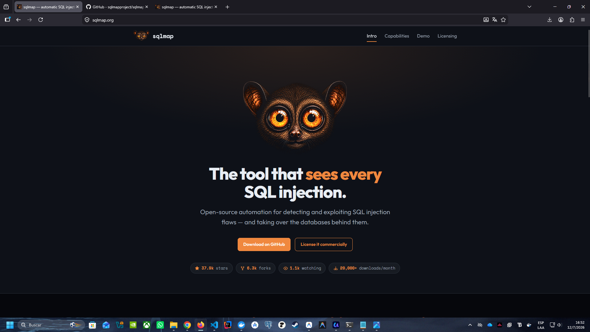

**Scripts en la Base de datos**

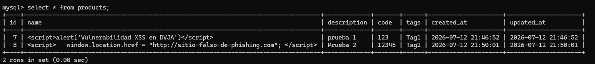

### Impacto

Al ser Stored XSS, el payload persiste en la base de datos y afecta a **todos** los usuarios que visiten la lista de productos. Los impactos incluyen: robo de cookies de sesión (secuestro de sesión), redirección a sitios de phishing para robo de credenciales, keylogging en el navegador de la víctima, y defacement de la interfaz de la aplicación.

> **Nota:** El único obstáculo técnico es la longitud máxima del campo en la base de datos. Los atacantes suelen alojar su script en un servidor externo e inyectar solo una etiqueta `<script src="...">` para cargarlo.

## VULN-03 · Fallas Criptográficas (MD5 sin salt)

| Campo | Detalle |
|---|---|
| **ID** | VULN-03 |
| **Nombre** | Almacenamiento inseguro de contraseñas con MD5 sin salt |
| **Categoría OWASP** | A04:2025 — Cryptographic Failures |
| **CWE** | CWE-328 · CWE-759 |
| **Severidad** | 🟠 ALTA |
| **Componente afectado** | Módulo de registro y autenticación de usuarios |
| **Archivo fuente** | `UserService.java` (método `hashEncodePassword`) |
| **Algoritmo usado** | MD5 sin salt (`DigestUtils.md5DigestAsHex`) |

### Descripción técnica

DVJA almacena las contraseñas de los usuarios aplicando únicamente un hash MD5 sin ningún valor de salt. MD5 está criptoanáliticamente comprometido desde 2004, y la ausencia de salt permite ataques mediante rainbow tables y diccionarios precomputados. El código fuente confirma este comportamiento:

```java
// CÓDIGO VULNERABLE — UserService.java
private String hashEncodePassword(String password) {
    return DigestUtils.md5DigestAsHex(password.getBytes());
}
```

### Flujo del ataque

**Paso 1** — Se registró un usuario de prueba con contraseña conocida desde `/register.action`.

**Paso 2** — Se accedió directamente a la base de datos MySQL del contenedor:

```bash
# Obtener contraseña del contenedor
docker inspect criptografia-trabajo-grupal-dvja-mysql-1 | findstr MYSQL

# Ingresar al contenedor
docker exec -it criptografia-trabajo-grupal-dvja-mysql-1 bash

# Autenticarse en MySQL
mysql -u root -p

# Consultar hashes de contraseñas
USE dvja;
SELECT id, login, password, email FROM users;
```

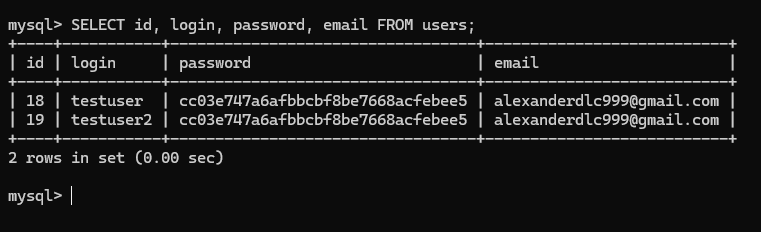

**Paso 3** — Se comprobó que los hashes tienen exactamente **32 caracteres hexadecimales** (característica inequívoca de MD5). Ambos usuarios registrados con la misma contraseña generan el mismo hash, confirmando la ausencia de salt:

```
Hash obtenido: cc03e747a6afbbcbf8be7668acfebee5
```

**Paso 4** — Se verificó el hash en [CrackStation](https://crackstation.net), una base de datos de hashes precomputados con más de 15 mil millones de entradas:

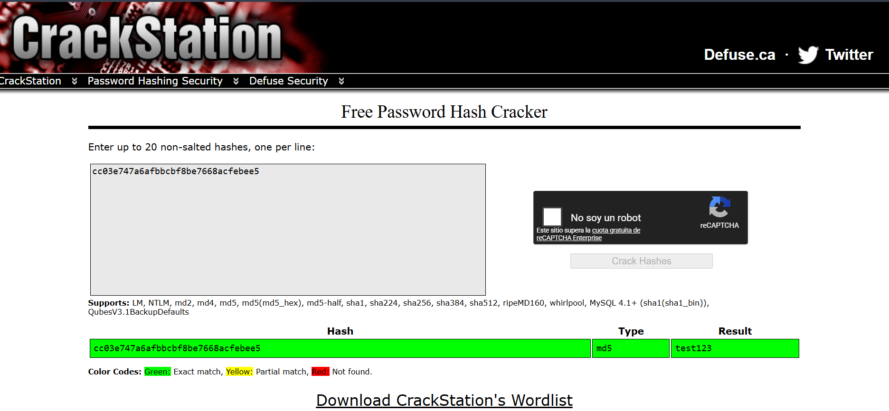

> ⚠️ La contraseña fue recuperada en **menos de 1 segundo** mediante tabla de búsqueda precomputada (rainbow table), sin fuerza bruta.

### Impacto

Si un atacante obtiene la base de datos (por ejemplo, mediante VULN-01), puede crackear todas las contraseñas en segundos. La ausencia de salt también significa que contraseñas idénticas generan el mismo hash, facilitando identificar usuarios que comparten contraseña.

### Remediación prevista (Fase 2)

```java
// CÓDIGO CORREGIDO — BCrypt con work factor 12
import org.springframework.security.crypto.bcrypt.BCryptPasswordEncoder;

private final BCryptPasswordEncoder encoder = new BCryptPasswordEncoder(12);

private String hashEncodePassword(String password) {
    return encoder.encode(password); // Salt generado automáticamente
}
```

---

## 3. Resumen de vulnerabilidades identificadas

| ID | Vulnerabilidad | OWASP | CWE | Severidad | Endpoint |
|---|---|---|---|---|---|
| VULN-01 | HQL Injection | A05:2025 | CWE-943 | 🔴 CRÍTICA | `/userSearch.action` |
| VULN-02 | Stored XSS | A05:2025 | CWE-79 | 🟠 ALTA | `/addEditProduct.action` |
| VULN-03 | MD5 sin salt | A04:2025 | CWE-328 | 🟠 ALTA | Base de datos |

---

## 4. Conclusiones de la Fase 1

Se levantó exitosamente el entorno de pruebas DVJA mediante Docker Compose, resolviendo dos inconvenientes técnicos: la imagen JDK obsoleta y el problema de finales de línea CRLF/LF en Windows. La aplicación quedó operativa en `http://localhost:8080`.

Se identificaron y explotaron **tres vulnerabilidades** del OWASP Top Ten, superando el mínimo requerido. Las vulnerabilidades VULN-01 (HQL Injection), VULN-02 (Stored XSS) y VULN-03 (MD5 sin salt) son particularmente peligrosas en combinación: la primera permite extraer la base de datos con los hashes de contraseñas, la segunda expone a todos los usuarios a ejecución de código malicioso, y la tercera permite recuperar las contraseñas en texto plano en segundos dado el uso de MD5 sin salt.

Todos los hallazgos documentados en esta Fase 1 serán remediados en la **Fase 2** mediante: consultas HQL parametrizadas, escapado de salida HTML, y migración de MD5 a BCrypt con work factor 12. La **Fase 3** abordará el hardening del contenedor Docker y las dependencias del `pom.xml`.

---

<div align="center">
  <sub>Universidad Central del Ecuador · Carrera de Computación · 2026</sub>
</div>
